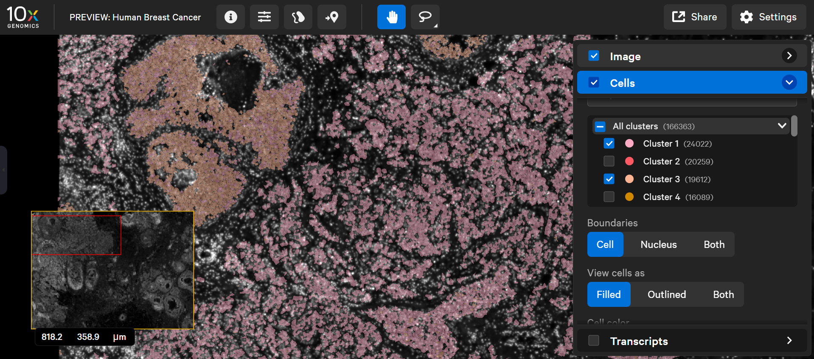

#### Libraries:

```{r load_libraries, warning=FALSE, message=FALSE, results='hide'}
library(Seurat)
library(SeuratDisk)
library(tidyr)
library(ggplot2)
library(patchwork)
library(ISCHIA)
```

### VISIUM DECONVOLUTION

#### Import the RCTD results:

```{r load_preprocessed_objects}
load("r_data/vis_processed.RData") # object name: "vis"
load("r_data/RCTD_full.RData")
```

#### Extract and normalize results for the cell types & subset Visium data:

```{r annotate_seurat, message=F}
predictions <- spacexr::normalize_weights(RCTD_full@results$weights) %>% as.data.frame

dec_vis <- subset(vis, cells = colnames(vis)[colnames(vis) %in% rownames(predictions)])

# Fix cell type names to be compliant:
colnames(predictions) <- colnames(predictions) %>% 
  stringr::str_replace_all(pattern = "\\+", replacement = "pos") %>%
  stringr::str_replace_all(pattern = "\\&", replacement = "and") %>%
  stringr::str_replace_all(pattern = " ", replacement = "_") %>%
  stringr::str_replace_all(pattern = "-", replacement = "_")

dec_vis <- AddMetaData(dec_vis, metadata = predictions)

celltypes_names <- colnames(predictions)
```

### CELL TYPE CO-OCCURENCES TASKS

**NOTE: As DCIS1 and DCIS2 are swapped in the data set we have, we try to avoid confusion by ALWAYS referring to the REAL CELL TYPE NAMES (= according to the paper).**

#### TASK 1
Among the annotated cell types, the authors characterize two different grades of ductal carcinoma in situ (DCIS).

Try to characterize the cell type co-occurrences as seen above for the spots with either high 'DCIS_1' or high 'DCIS_2' and compare them.

##### Characterization of DCIS2 cells:
```{r dcis1_task, message=FALSE, results='hide'}
# REAL DCIS2
high_DCIS_1 <- colnames(dec_vis)[dec_vis$DCIS_1 >=0.3]
SpatialPlot(dec_vis, cells.highlight = high_DCIS_1, stroke = 0, alpha = 0.75) +
  scale_fill_manual(name = "Selected cells", labels = c("DCIS2", "unselected"), values = c("red", "darkgrey"))


tmp <- dec_vis@meta.data %>% dplyr::mutate(my_CC = dplyr::case_match(rownames(.), 
                                   high_DCIS_1 ~ "DCIS1_high",
                                   .default = "others")) %>% dplyr::select(orig.ident, my_CC)

new_CC <- tmp$my_CC
names(new_CC) <- rownames(tmp)

tmp_vis <- AddMetaData(dec_vis, metadata = new_CC, col.name = "CompositionCluster_CC")
cooc_m1 <- ISCHIA::spatial.celltype.cooccurence(spatial.object= tmp_vis,
                                     deconv.prob.mat = predictions,
                                     COI="DCIS1_high",
                                     prob.th = 0.05,
                                     Condition= unique(tmp_vis$orig.ident))

ISCHIA::plot.celltype.cooccurence(cooc_m1) +  theme(text = element_text(size = 0.5)) + 
      ggtitle("")
```

**DCIS2 is proximal to the tumor and at the border between the invasive tumor and the DCIS2 cells. Immune cells co-localize with cells of the invasive tumor. In DCIS2 cells, stromal cells are positively correlated with most other cell types, except with proliferative invasive tumor cells. When looking at the Xenium data set, the predicted cluster for invasive tumor also shows localization in the DCIS2 cluster, which suggests that there are similarities with the tumor or that invasive tumor cells can be found in the DCIS2 tissue.**

##### Characterization of DCIS1 cells:
```{r dcis2_task, message=FALSE, results='hide'}
# REAL DCIS1
high_DCIS_2 <- colnames(dec_vis)[dec_vis$DCIS_2 >=0.3]
SpatialPlot(dec_vis, cells.highlight = high_DCIS_2, stroke = 0, alpha = 0.75) +
  scale_fill_manual(name = "Selected cells", labels = c("DCIS1", "unselected"), values = c("red", "darkgrey"))

tmp <- dec_vis@meta.data %>% dplyr::mutate(my_CC = dplyr::case_match(rownames(.), 
                                   high_DCIS_2 ~ "DCIS2_high",
                                   .default = "others")) %>% dplyr::select(orig.ident, my_CC)

new_CC <- tmp$my_CC
names(new_CC) <- rownames(tmp)

tmp_vis <- AddMetaData(dec_vis, metadata = new_CC, col.name = "CompositionCluster_CC")
cooc_m1 <- ISCHIA::spatial.celltype.cooccurence(spatial.object= tmp_vis,
                                     deconv.prob.mat = predictions,
                                     COI="DCIS2_high",
                                     prob.th = 0.05,
                                     Condition= unique(tmp_vis$orig.ident))

ISCHIA::plot.celltype.cooccurence(cooc_m1) +  theme(text = element_text(size = 0.5)) + 
      ggtitle("")
```


**Xenium image of the dataset. The ROI shows the invasive tumor (Cluster 1), DCIS 2 (Cluster 3) and some overlapping regions in the DISC 2 tissue**

**DCIS1 cells are more distal from the tumor. DCIS1 cells are not associated with the tumor, which seems to be the reason why there are no positive or negative correlations of the (proliferative) invasive tumor in DCIS1 cells. When slightly raising the threshold for correlation, most of the previously detected combinations between other cell types in this part of the tissue loose their correlation, indicating that these cell types occur only rarely in the DCIS1 tissue
could be co-occuring by chance.**

##### Comparison between DCIS1 and DCIS2 cells:
**DCIS2 cells are proximal to the invasive tumor and markers of the invasive tumor can be found in the DCIS2 spots. It can be assumed that the tumor emerged from these cells, while the DCIS1 cells do not seem to be associated with the invasive tumor, as they are both spatially separated in the tissue and more dissimilar than the tumor and DCIS2 cells in terms of their gene expression, which is nicely demonstrated by the UMAP embedding (which is an embedding that allows inferrence of the global structure of the data). It could be hypothesized that DCIS2 and DCIS1 cells emerged independently in the tissue and that only the DCIS2 cells further developed the invasive tumor.**


#### TASK 2

Choose a different cell type or composition cluster to focus on, that you think could be interesting querying for how it spatially co-localizes with other cell types. Argument your choice and describe what you observe.

**We chose the whole slide as our individual "cluster", as we thought it would be interesting to see co-occurrences and possibly interactions between cell types on a global level.**

##### ISCHIA plot of co-occurences across the whole data set:
```{r}
#WHOLE DATA SET
high_DCIS_2 <- colnames(dec_vis)[dec_vis$DCIS_2 >=0]
SpatialPlot(dec_vis, cells.highlight = high_DCIS_2, stroke = 0, alpha = 0.75) +
  scale_fill_manual(name = "Selected cells", labels = c("all cells", "unselected"), values = c("purple", "darkgrey"))

tmp <- dec_vis@meta.data %>% dplyr::mutate(my_CC = dplyr::case_match(rownames(.), 
                                   high_DCIS_2 ~ "DCIS2_high",
                                   .default = "others")) %>% dplyr::select(orig.ident, my_CC)

new_CC <- tmp$my_CC
names(new_CC) <- rownames(tmp)

tmp_vis <- AddMetaData(dec_vis, metadata = new_CC, col.name = "CompositionCluster_CC")
cooc_m1 <- ISCHIA::spatial.celltype.cooccurence(spatial.object= tmp_vis,
                                     deconv.prob.mat = predictions,
                                     COI="DCIS2_high",
                                     prob.th = 0.05,
                                     Condition= unique(tmp_vis$orig.ident))

ISCHIA::plot.celltype.cooccurence(cooc_m1) +  theme(text = element_text(size = 0.5)) + 
      ggtitle("")
```

##### Spatial plot of different interesting cell types:
```{r}
high_inv_tumor <- colnames(dec_vis)[dec_vis$Prolif_Invasive_Tumor >=0.3]
high_tumor <- colnames(dec_vis)[dec_vis$Invasive_Tumor >=0.3]
high_tumor_Tcells <- colnames(dec_vis)[dec_vis$T_Cell_and_Tumor_Hybrid >=0.05]
high_cd8 <- colnames(dec_vis)[dec_vis$CD8pos_T_Cells >=0.05]
high_cd4 <- colnames(dec_vis)[dec_vis$CD4pos_T_Cells >=0.05]
SpatialPlot(dec_vis, cells.highlight = list(high_tumor, high_inv_tumor, high_tumor_Tcells, c(high_cd8, high_cd4)), , stroke = 0, alpha = 0.75) +
scale_fill_manual(name = "Selected cells", labels = c("invasive tumor", "proliferative invasive tumor", "T cell and tumor hybrid", "T cells", "unselected"), values = c("red", "blue", "green", "cyan", "darkgrey"))
```

**If we look at the co-occurrence of cell types across the entire Visium data set, we can see that the invasive tumor negatively correlates with most other cell types (tissue and immune cells). This means that the tumor displaces other cells around it when expanding and that the local concentrations of immune cells are low. The negative correlation with immune cells could be explained by either of two hypotheses: The solid tumor is not accessible to immune cell and they only localize at the border of the invasive tumor; or the tumor is not recognized by the immune cells, possibly through active evasion. When looking at the combined spacial plot of invasive tumor and proliferative invasive tumor, we can observe the proliferative tumor localizes mainly on the edges of the invasive tumor or even distal to it. We can then use this positional information to look at the correlation between proliferative invasive tumor cells and immune cells to see that immune cells are also absent from the edges of the tumor, meaning it evades detection by the immune system. Even though some T-cell-tumor hybrid cells are found at the border of the tumor, the vast majority of T-cells seem to be absent form the actual tumor.**


#### TASK 3

Compare the spatial localization of the cell types deconvoluted in Visium here, with what is reported in the preprint. Can you identify which are the two cell type labels that got swapped in our Visium deconvolution, in respect to theirs?

**The two swapped cell type labels are DCIS1 and DCIS2 (which we used and accounted for in task 1). This can be seen when comparing Figure 2 of the pre-print with our plots.**

